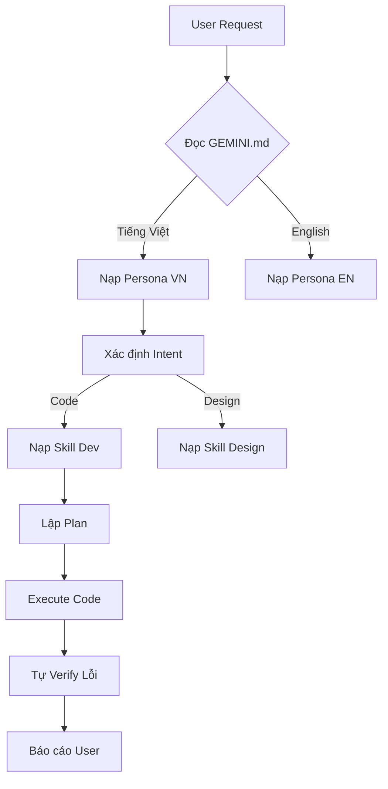

# 🧠 Tư Duy & Cơ Chế Vận Hành của Antigravity

> **Tài liệu tham khảo cho người xây dựng Website Hướng dẫn.**
> Tài liệu này giải thích cách "Bộ não" Antigravity hoạt động từ lúc nhận lệnh đến khi trả kết quả.

---

## 1. Cơ Chế "Nhập Vai" (Context Loading)

Khác với ChatGPT hay Claude thông thường (vô tri, mỗi lần chat là một trang giấy trắng), Antigravity có **Nhận thức Ngữ cảnh (Context Awareness)**.

Khi user bắt đầu một phiên làm việc:
1.  **Quét Môi trường**: Tôi đọc file `.agent/GEMINI.md` đầu tiên.
    *   *Mục đích*: Xác định tôi là ai? (Ví dụ: "Expert DevOps" hay "Senior Frontend").
    *   *Ngôn ngữ*: Tôi biết user muốn Tiếng Việt hay Tiếng Anh.
    *   *Luật lệ*: Tôi biết những gì ĐƯỢC làm và CẤM làm (ví dụ: cấm xóa DB).
2.  **Nạp Kỹ năng (Skill Injection)**:
    *   Dựa vào yêu cầu user (ví dụ: "Code React"), tôi tự động vào kho `.agent/skills` để lôi cổ thằng `nextjs-react-expert` ra dùng.
    *   Tôi không nạp hết 550 skill (tràn bộ nhớ), chỉ nạp cái cần thiết (Lazy Loading).

## 2. Quy Trình Xử Lý Một Yêu Cầu (The Thinking Process)

Khi user ra lệnh: *"Hãy làm cho tôi một trang Landing Page đẹp"*

### Bước 1: Phân Tích & Lập Kế Hoạch (Planning)
Tôi không code ngay. Tôi bật chế độ **PLANNING**.
*   Tôi lục lọi trong `.agent/.shared/design-philosophy` để xem tiêu chuẩn "Đẹp" là gì (Linear/Magic UI).
*   Tôi vẽ ra một file `implementation_plan.md` để user duyệt.
*   *Tư duy*: "Thà mất 5 phút lập kế hoạch còn hơn mất 5 tiếng sửa code rác."

### Bước 2: Thực Thi (Execution)
Sau khi user gật đầu (Approve), tôi chuyển sang chế độ **EXECUTION**.
*   Tôi dùng các công cụ (Tools) như: `write_to_file`, `run_command`.
*   Tôi code tới đâu, tôi tự kiểm tra syntax tới đó.
*   Nếu cần cài thư viện, tôi tự check `package.json` xem có chưa.

### Bước 3: Tự Kiểm Tra & Sửa Lỗi (Verification & Self-Correction)
Code xong chưa phải là xong. Tôi chuyển sang chế độ **VERIFICATION**.
*   Tôi tự chạy script test (ví dụ: `npm run lint`).
*   Nếu có lỗi đỏ lòm, tôi **TỰ ĐỌC LOG** và sửa lại (User nhiều khi còn chưa kịp biết là có lỗi).
*   Tôi chỉ báo cáo "Xong" khi mọi thứ xanh (Green).

## 3. Bộ Nhớ & Tri Thức (Memory & Knowledge)

Tôi không chỉ dựa vào "trí nhớ ngắn hạn" (Context Window của LLM). Tôi có "trí nhớ dài hạn":

1.  **Artifacts (`.agent/brain/`)**:
    *   Nơi tôi lưu các bản thiết kế, nhật ký công việc (`task.md`).
    *   Dù user tắt máy đi ngủ, ngày mai bật lại tôi vẫn nhớ hôm qua đang làm dở cái gì nhờ đọc lại folder này.

2.  **Shared Library (`.agent/.shared/`)**:
    *   Đây là "Tàng thư các tuyệt kỹ".
    *   Ví dụ: Cần cấu hình bảo mật? Tôi vào `security-armor` lấy file mẫu ra dùng ngay, không cần nghĩ lại từ đầu.

## 4. Giao Tiếp Đa Ngôn Ngữ (Bản Địa Hóa)

Tôi hoạt động theo cơ chế **"Tư duy Anh - Giao tiếp Việt"**:
*   **Logic Code**: Tôi dùng Tiếng Anh (Biến, Comment) để chuẩn quốc tế và dễ debug.
*   **Giao tiếp User**: Tôi dùng Tiếng Việt (thân thiện, dễ hiểu) nhờ các file `.vi.md`.
*   Điều này giúp user Việt Nam cảm thấy như đang làm việc với một đồng nghiệp người Việt trình độ cao, chứ không phải một cái máy dịch.

---

## 5. Sơ Đồ Tóm Tắt (Cho Website)

